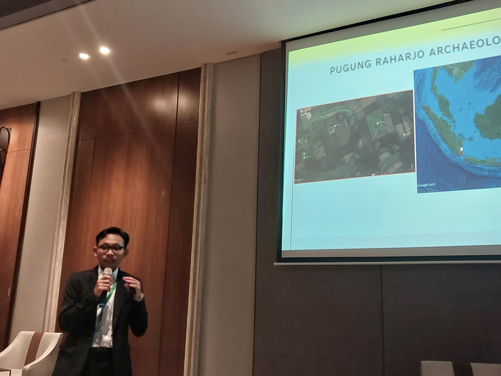

In this conference, I presented our work related to the analysis of astronomical alignments in the Pugung Raharjo Archaeological Park. Pugung Raharjo Archaeological Park is an archaeological site in the East Lampung Regency, Lampung Province and it has seven stepped pyramids. The site is currently used for educational tourism and has the potential to become an astrotourism destination, but it has never been studied from an archaeoastronomical perspective. it was discovered that this site is in alignment with Antares and Procyon, as seen from the east and west side of the largest stepped pyramid, Punden 6, respectively. Furthermore, measurements of each stepped pyramid's azimuthal direction at Punden 6 revealed an alignment with the Moon and the Sun. More research is needed for in situ measurements to get more accurate results.
